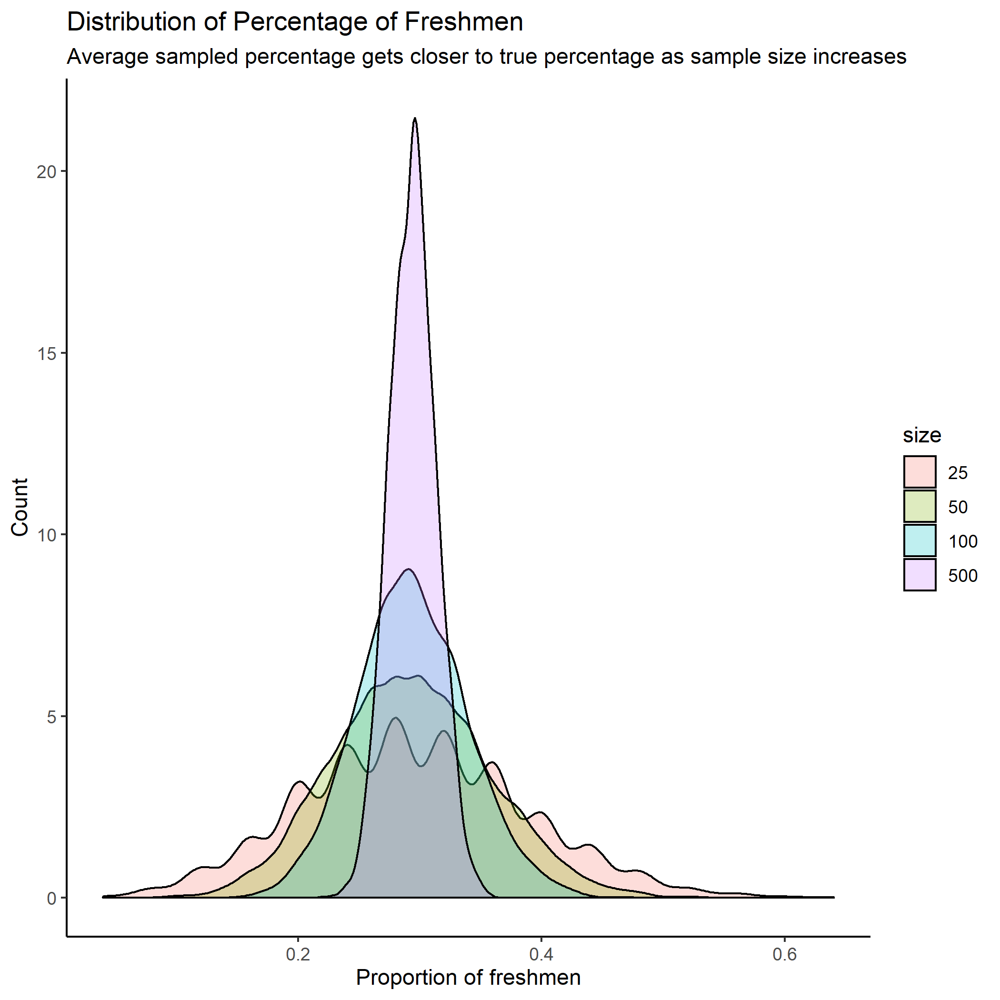

```{r setup, include=FALSE}
knitr::opts_chunk$set(echo = TRUE)

# upload libraries to upload and process data and make gt table

library(tidyverse)
library(haven)
library(gt)
library(infer)

# upload dta data file 

dec <- read_dta("raw-data/ns20191226/ns20191226.dta")

```

## MadLibs

```{r madlibs, echo = FALSE}

# q1; find total respondents in gun_registry to see total who answered this
# question. In order to accomodate for the filter function not counting NA
# induviduals, who were asked the question but chose not to answer, I am
# explicitly retaining NA values when filtering alongside removing "888" (not
# asked) from gun_registry respondents to give the total number of people who
# were asked this question


q1 <- dec %>% 
  select(gun_registry) %>% 
  filter(is.na(gun_registry) |
           gun_registry != 888) %>% 
  summarize(sum(n()))


# q2; since all respondents were asked all 3 gun questions other than the
# registry question (as the codebook indicates the other questions do not have
# an "888" option), I filtered out the induviduals from the dataset who were
# "888" for gun_registry to get the number of people who answered all 4
# quesstions. Then since q1 is the total number of people asked questions, I
# filtered for all gun owners and divided this number by q1. I multiplied by 100
# and rounded to 2 decimal places to get the percent of all-respondents who are
# gun owners

gun_owners_asked <- dec %>% 
  filter(is.na(gun_registry) |
           gun_registry != 888) %>% 
  filter(household_gun_owner == 1) %>% 
  summarize(sum(n()))

percent_own <- (gun_owners_asked/q1)*100

q2 <- round(percent_own, 2)


# q3; drop respondents who weren't asked, didn't know, or skipped the question.
# Then filter for those who live in a household with guns, sum
# statements_gun_rights, and divide by total number of people who still fit
# criteria. Meanwhile, filter for those who do not live in a household with guns
# with similar processing. Finally, round each answer to 2 decimal places

gun_own_agree <- dec %>% 
  filter(household_gun_owner == 1 |
           household_gun_owner == 2) %>% 
  filter(statements_gun_rights != 888 &
           statements_gun_rights != 999) %>% 
  summarize(sum(statements_gun_rights)/sum(n())) %>% 
  pull(1)

gun_own_agree <- format(round(gun_own_agree, 2), nsmall = 2)


no_gun_agree <- dec %>% 
  filter(household_gun_owner == 3) %>% 
  filter(statements_gun_rights != 888 &
           statements_gun_rights != 999) %>% 
  summarize(sum(statements_gun_rights)/sum(n())) %>% 
  pull(1)

no_gun_agree <- format(round(no_gun_agree, 2), nsmall = 2)


# q4; filter within respective age groups, sort for top number of respondents,
# and then use haven_label labels (using as_factor) to extract the name of
# religion which is most followup per both subsets

religion_young <- dec %>% 
  filter(age %in% c(18,29)) %>% 
  count(religion) %>% 
  arrange(desc(n))

religion_y <- as_factor(religion_young, 
                        levels = c("labels"), 
                        ordered = FALSE) %>%  
  mutate(relig = as.character(religion)) %>% 
  slice(1) %>% 
  pull(relig)

 

religion_old <- dec %>% 
  filter(age >= 30) %>% 
  count(religion) %>% 
  arrange(desc(n)) 

religion_o <- as_factor(religion_old, 
                        levels = c("labels"), 
                        ordered = FALSE) %>% 
  mutate(relig = as.character(religion)) %>% 
  slice(1) %>% 
  pull(relig)


# q5; takes arranged list of religions popularity, and creates a rank col which
# ranks the popularity of religion per age group. Then, I select for the
# religion wanted to find its rank

young_rank <- as_factor(religion_young, 
                        levels = c("labels"), 
                        ordered = FALSE) %>% 
  mutate(rank = c(1:sum(n()))) %>% 
  filter(religion == "Nothing in particular") %>% 
  pull(rank)

old_rank <- as_factor(religion_old, 
                        levels = c("labels"), 
                        ordered = FALSE) %>% 
  mutate(rank = c(1:sum(n()))) %>% 
  filter(religion == "Nothing in particular") %>% 
  pull(rank)


# q6; filtering for the 888 option from statements_gun_rights, we find all of
# our relavent respondents. making a table grouping by religion and
# staements_gun_righs, we feed this table to as_factors to categorize
# statement_gun_rights and religion, and then select the most popular position
# from all the "nones"

religion <- dec %>% 
  filter(statements_gun_rights != 888) %>% 
  count(statements_gun_rights, religion)

nones <- as_factor(religion,
                   levels = c("labels"), 
                   ordered = FALSE) %>% 
  filter(religion == "Nothing in particular") %>% 
  arrange(desc(n)) %>% 
  mutate(position = as.character(statements_gun_rights)) %>% 
  slice(1) %>% 
  pull(position)

```

**1)** Not all respondents were asked every question. `r q1` respondents were asked the question about whether the USA should create a gun registry.

**2)**  Of the respondents that got asked all four gun policy questions, `r q2` percent are gun owners. 

**3)** The average “agreement” score (from 1-4) on the statement_gun_rights variable is `r no_gun_agree` for those respondents who live in households without guns, while the average “agreement” score in households with guns is `r gun_own_agree`.

**4)** Another set of questions asks about religion. The first ranked category of religion for the age group of people 18-30 is `r religion_y`. The first-ranked religion category for people 30 and older is `r religion_o`. 

**5)** Lots of people say that the younger generation has the highest percent of “nones;” people who answer “nothing in particular”, when you ask them their religion. In the 18-30 age group, “nothing in particular” is ranked `r young_rank`, while in the 30 and above group, “nothing in particular” is ranked `r old_rank`.

**6)** Consider again the nones (all people who responded “nothing in particular”) when asked about their religion. In this group, the most popular position is to `r nones` that it is more important for the government to control who owns guns than it is for the government to protect the right to own guns. 

## Question 2: Simulations with List Columns

```{r q2, echo = FALSE}
# 2a; makes a draw cards function which can only take numeric and have
# replacement when drawing cards

draw_cards <- function(n) {
   if(!is.numeric(n)) {
    stop('I am so sorry, but this function only works for numeric input!\n',
         'You have provided an object of class: ', class(n)[1])
  }
  sample(x = c("diamonds", "hearts", "spades", "clubs"), 
         size = n,
         replace = TRUE)
}


# 2b; makes a table of 2 cards being drawn 10 times using map

card_table <- tibble(cards = map(1:10, ~ draw_cards(2)))


# 2c; make a new column which checks for hearts or diamonds in the first and
# second col to accordingly mark if the card drawn is red or not.


card_table <- card_table %>% 
  mutate(check_red = map_lgl(map_chr(card_table$cards, 1),
                               ~ ifelse(. %in% c("hearts", "diamonds"), 
                                        TRUE, 
                                        FALSE)
                               ),
         check_red_2 = map_lgl(map_chr(card_table$cards, 2),
                               ~ ifelse(. %in% c("hearts", "diamonds"), 
                                        TRUE, 
                                        FALSE)
                               )
  )

# we then combine both check_red cols to a matrix, which we turn into a list
# where each item of the list tells if a set of cards are both red, both black,
# or mixed. I convert this list to characters so that we can check if each row
# for sets of cards drawn are (TRUE, TRUE), (FALSE, FALSE), or neither, which
# can identify if cards are both red, both black, or mixed respectively. Now
# that I have a string which describes each pair of cards, I use function
# color_outcome (which is compatabile with map function) so that we can see if
# each pair's description

color_outcome <- function (x) {
  if (all(x == "c(TRUE, TRUE)")) {
    "Both red"
  } else if (all(x == "c(FALSE, FALSE)")) {
      "Both black"
  } else {
      "Mixed"
  }
}

ll <- matrix(c(card_table$check_red, card_table$check_red_2), nrow = 10, byrow = FALSE)
ll <- t(ll)
bb <- split(ll, rep(1:ncol(ll), each = nrow(ll)))
bb <- as.character(bb)

card_table <- card_table %>% 
  mutate(check_combined = map_chr(bb, color_outcome)
  )


# finally, we format our complete table to a gt table, and print it

card_table %>% 
  gt(auto_align = TRUE) %>% 
  tab_header(title = "Drawing Two Cards",
             subtitle = "Card Colors") %>%
  cols_label(cards = "Draw",
             check_red = "First card red?",
             check_red_2 = "Second card red?",
             check_combined = "Color Outcome"
             )

# 2e; copying code from 2d with card_table now run 1000 times

card_table <- tibble(cards = map(1:1000, ~ draw_cards(2)))

card_table <- card_table %>% 
  mutate(check_red = map_lgl(map_chr(card_table$cards, 1),
                               ~ ifelse(. %in% c("hearts", "diamonds"), 
                                        TRUE, 
                                        FALSE)
                               ),
         check_red_2 = map_lgl(map_chr(card_table$cards, 2),
                               ~ ifelse(. %in% c("hearts", "diamonds"), 
                                        TRUE, 
                                        FALSE)
                               )
  )

color_outcome <- function (x) {
  if (all(x == "c(TRUE, TRUE)")) {
    "Both red"
  } else if (all(x == "c(FALSE, FALSE)")) {
      "Both black"
  } else {
      "Mixed"
  }
}

ll <- matrix(c(card_table$check_red, card_table$check_red_2), nrow = 1000, byrow = FALSE)
ll <- t(ll)
bb <- split(ll, rep(1:ncol(ll), each = nrow(ll)))
bb <- as.character(bb)

card_table <- card_table %>% 
  mutate(check_combined = map_chr(bb, color_outcome)
  )

# now that we have the simulation for 1000 trials, we find the probability of
# mixed by counting mixed and dividing by 1000 trials

probab <- card_table %>% 
  count(check_combined) %>% 
  filter(check_combined == "Mixed") %>% 
  pull(n)/1000

```

After running 1000 simulations of drawing a pair of cards, the probability of drawing a red card and black card (a mixed pair), is `r probab * 100` percent.


## Question 3: Modeling a Study Population

```{r q3, echo = FALSE}

# made a tibble which had an id col and using rep a grade col. Then I made a
# percent proportion of students per grade col and rounded the prop to 2 decimal
# places. Finally, in the ggplot, I used a paste to label each bar with a
# percent number and the "%" sign, used vjust to make sure labels do not overlap
# the bars, and added a percent to y-axis labels

pop <- tibble(id = c(1:6120),
              grade = c(rep("freshman", 1800),
                        rep("sophomore", 1450),
                        rep("junior", 1570),
                        rep("senior", 1300)
                        )
              )

pop_comp <- pop %>% 
  count(grade) %>% 
  mutate(pct = round((n/6120*100), 2))

ggplot(pop_comp, aes(x = grade, y = pct)) +
  geom_col() +
  geom_text(aes(label = paste(as.character(pct),"%"), vjust = -.3),
            size = 3.2) +
  labs(title = "University Composition by Grade",
       subtitle = "Entire Study Population") +
  scale_y_continuous(labels = c("0%", "10%", "20%", "30%")) +
  theme_classic()

```


## Question 4: Sampling

```{r q4, echo = FALSE}

# set seed to have data distribution to be similar to Preceptor's. then I made a
# table x which calculates the proportion of freshmen in each sample. Then, I
# plot a histogram with binwidth and boundaries which are easy to read and
# capture the distribution of freshman per sample well.

set.seed(02139) 

x <- rep_sample_n(pop, size = 25, reps = 5000) %>% 
  group_by(replicate) %>%  
  summarize(frosh = sum(grade == "freshman")) %>% 
  mutate(prop_frosh = frosh/25)

ggplot(x, aes(x = prop_frosh)) +
  geom_histogram(binwidth = 0.04, boundary = .24, color = "white") +
  scale_x_continuous(breaks = c(0.08, 0.16, 0.24, 0.32, 0.4, 0.48, 0.56, 0.64),
                     labels = c("0.08%", "0.16%", "0.24%", "0.32%", "0.4%", "0.48%", "0.56%", "0.64%")
                     ) +
  labs(title = "Harvard Students Proportion of Freshman",
       subtitle = "Derived from 5000 Virtual Samples of 25 Students",
       x = "Percent of Freshman",
       y = "Number of Samples")

```

## Question 5: Sampling and Sample Size

```{r q5, echo = FALSE}

# creates a named list sizes which displays what size a sample was when
# proportion was calculated to use with map_df

samp_size = c(25,50,100,500)
sizes <- set_names(samp_size, nm = samp_size)

set.seed(02139)

# use map_df to make a table which samples from pop 5000 times per each size in
# sizes, and labels which size number each rep slice came from. Then, group_by
# size and rep number (w/o grouping many samples are not disjoint) and find the
# proportion of freshman per every rep. calculate prop_frosh with as.numeric
# size since named list sizes had size vales as chr

university <- map_df(sizes,
                     ~ rep_sample_n(pop,
                                    size = .x,
                                    reps = 5000),
                     .id = "size"
                     )  %>% 
  group_by(size, replicate) %>% 
  summarize(frosh = sum(grade == "freshman")) %>%    
  mutate(prop_frosh = frosh/as.numeric(size))


# use ggplot geom_density to graph distribution of percentage of freshman count
# change based on size which was sampled. used factor to relevel size so that
# legend values appear in the value we desire

university$size <- factor(university$size, levels = c("25", "50", "100", "500"))
                    
ggplot(university, aes(x = prop_frosh, fill = size)) +
  geom_density(alpha = 0.25) +
  theme_classic() +
  labs(title = "Distribution of Percentage of Freshmen",
       subtitle = "Average sampled percentage gets closer to true percentage as sample size increases",
       x = "Proportion of freshmen",
       y = "Count")
  

```


## Question 6: Publish Your Plot

Here is the Distribution of Percentage of Freshmen plot from the simulated Harvard College Class:

```{r q6, echo = FALSE}

## importing graphic from rpubs entry


```

Here is the link to my RPubs account where the same graphic is uploaded: https://rpubs.com/arnavinator/584883


## Question 7: Reprex

```{r q7, echo = FALSE}
# REMOVE AS NUMBERIC FOR YOU REPREX ERROR
university <- map_df(sizes,
                     ~ rep_sample_n(pop,
                                    size = .x,
                                    reps = 5000),
                     .id = "size"
                     )  %>% 
  group_by(size, replicate) %>% 
  summarize(frosh = sum(grade == "freshman")) %>%    
  mutate(prop_frosh = frosh/as.numeric(size))

university$size <- factor(university$size, levels = c("25", "50", "100", "500"))
                    
ggplot(university, aes(x = prop_frosh, fill = size)) +
  geom_density(alpha = 0.25) +
  theme_classic() +
  labs(title = "Distribution of Percentage of Freshmen",
       subtitle = "Average sampled percentage gets closer to true percentage as sample size increases",
       x = "Proportion of freshmen",
       y = "Count")


```

Collaborators: None. Check for titles!!!!

